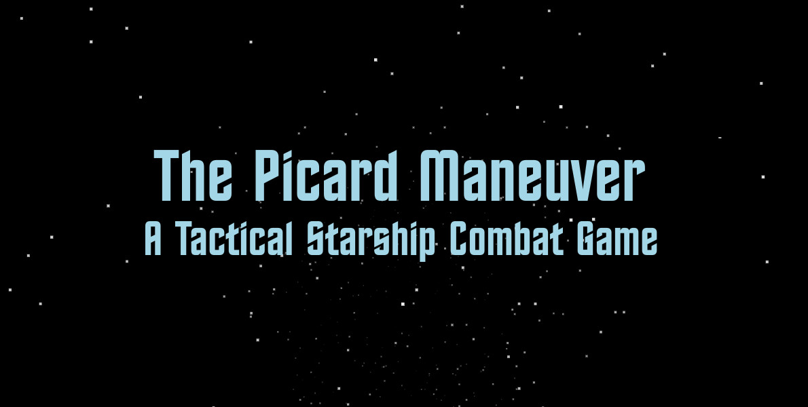
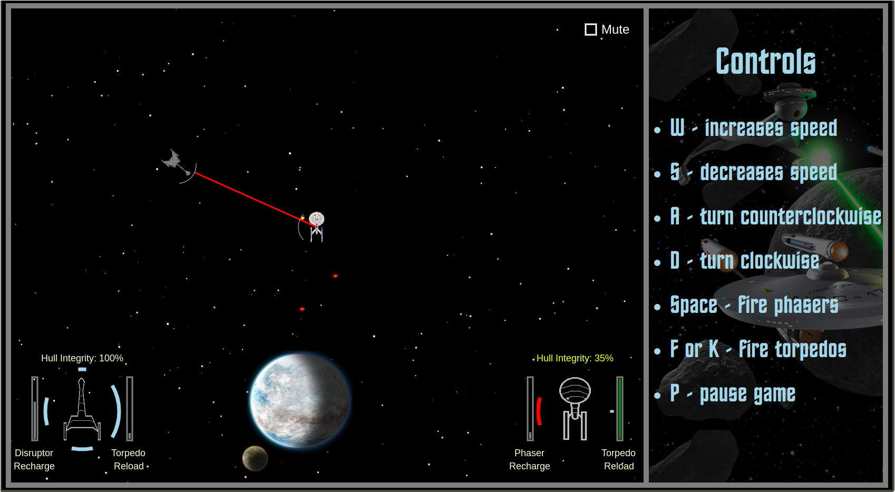

<a href="https://shoemker.github.io/picard_maneuver/"></a>

<h2>Picard Maneuver Overview</h2>
You are in control of a starship thrust into combat with an enemy. By controlling your speed and direction and firing your phasers and torpedos, you can destroy the other ship. Just watch out because the other ship has it's own weapons.
<br><br>
<h2>Technologies Used</h2>
<ol>
	<li>JavaScript: This game is written entirely in JavaScript.</li>
	<li>Canvas: And rendered with the Canvas element.</li>
</ol>
<br>
<h2>Features</h2>
<ol>
	<li>Control over your ship (speed, direction, weapons).</li>
	<li>Optional autopilot if you just want to watch.</li>
	<li>Visuals for beam weapon and torpedos.</li>
	<li>Shields show on hit (until they're down.</li>
	<li>Game music and sound effects.</li>
	<li>Mute and pause options.</li>
	<li>Moving starfield to indicate main ship movement.</li>
	<li>Ship Systems Display in corner to indicate shield strength, hull integrity and weapon recharge status.</li>
</ol>
<br>
<a href="https://shoemker.github.io/picard_maneuver/"></a>
<br>
<br>
<h2>Interesting Code</h2>
<p>There are cases in which it is necessary to determine the angle to another ship. </p>
<ol>
	<li>When determining which shield is being hit by enemy fire.</li>
	<li>When determining if the enemy ship (or the main ship on autopilot) should fire torpedos.</li>
</ol>
<p>We have a ship (ship1) which is getting fired  by ship2 or is deciding if ship2 is in it's torpedo firing arc. We can find the angle to the other ship by first determing the xDelta or difference in position of the ships in pixels on the x-axis and doing the same for yDelta on the y-axis. </p>
<p>Then we use Math.atan (which is arc tangent or inverse tangent) to get an angle from the two deltas. We may need to add PI or 2*PI to get a full circle of radians. Finally we subtract the ship1's rotation in radians to get the angle relative to ship1.</p>

```

	angleToOtherShip(ship, otherShip) {
		const xDelta = otherShip.center()[0] - ship.center()[0];
		const yDelta = otherShip.center()[1] - ship.center()[1];

		// find the angle between the 2 objects
		const arcTangent = Math.atan(yDelta / xDelta);
		if(xDelta < 0) angle = arcTangent + Math.PI;
		else if(xDelta > 0 && yDelta < 0) angle = arcTangent + Math.PI * 2;
		else angle = arcTangent;

		// take the rotation of the hit ship into account
		angle -= ship.getRotation();
		if (angle < 0) angle += Math.PI * 2;
		return angle;
	}

```