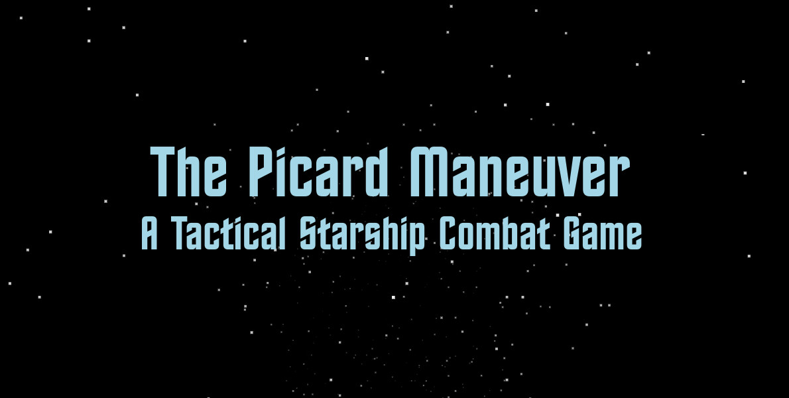
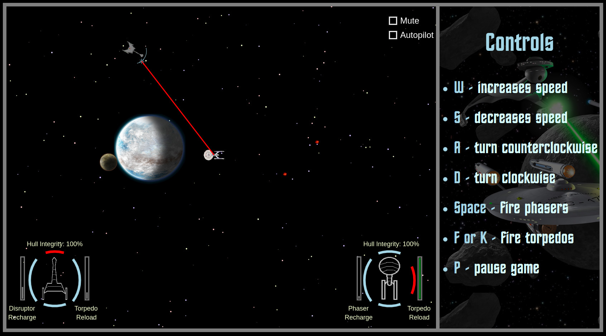

<a href="https://shoemker.github.io/picard_maneuver/"></a>

<h2>Picard Maneuver Overview</h2>
You are in control of a starship thrust into combat with an enemy. By controlling your speed and direction and firing your phasers and torpedos, you can destroy the other ship. Just watch out because the other ship has it's own weapons.
<br><br>
<h2>Technologies Used</h2>
<ol>
	<li>JavaScript: This game is written entirely in JavaScript.</li>
	<li>Canvas: And rendered with the Canvas element.</li>
</ol>
<br>
<h2>Features</h2>
<ol>
	<li>Control over main ship (speed, direction, weapons).</li>
	<li>Ship AI for enemies and allies</li>
	<li>Optional autopilot of the main ship if you just want to watch.</li>
	<li>Option to fight either one cruiser, 2 birds of prey, or fight in a fleet action.</li>
	<li>Visuals for beam weapons, torpedos, and cannons.</li>
	<li>Shields show on hit (until they're down).</li>
	<li>Game music and sound effects.</li>
	<li>Mute and pause options.</li>
	<li>Moving starfield to indicate main ship movement.</li>
	<li>Ship Systems Display (of adjustable size) in corner to indicate shield strength, hull integrity and weapon recharge status. Shield strength is indicated by size of shield. Transparent portrait of ship turns red as ship is damaged.</li>
	<li>When facing multiple enemies, a red target symbol appears on the ship that main ship is targeting, and a corresponding target appears on the enemy's Ship Systems Display. This is the ship that the 360 degree beam weapon will fire at. Target can be changed by player.</li>
</ol>
<br>
<a href="https://shoemker.github.io/picard_maneuver/"></a>
<br>
<br>
<h2>Interesting Code Example 1</h2>
<p>There are cases in which it is necessary to determine the angle to another ship. </p>
<ol>
	<li>When determining which shield is being hit by enemy fire.</li>
	<li>When determining if the enemy ship (or the main ship on autopilot) should fire torpedos.</li>
</ol>
<p>We have a ship (ship1) which is getting fired on by ship2 or is deciding if ship2 is in it's torpedo firing arc. We can find the angle to the other ship by first determing the xDelta or difference in position of the ships in pixels on the x-axis and doing the same for yDelta on the y-axis. </p>
<p>Then we use Math.atan (which is arc tangent or inverse tangent) to get an angle from the two deltas. We may need to add PI or 2*PI to get a full circle of radians. Finally we subtract the ship1's rotation in radians to get the angle relative to ship1.</p>

```
angleToOtherShip(ship, otherShip) {
	const xDelta = otherShip.center()[0] - ship.center()[0];
	const yDelta = otherShip.center()[1] - ship.center()[1];

	// find the angle between the 2 objects
	const arcTangent = Math.atan(yDelta / xDelta);
	if (xDelta < 0) angle = arcTangent + Math.PI;
	else if(xDelta > 0 && yDelta < 0) angle = arcTangent + Math.PI * 2;
	else angle = arcTangent;

	// take the rotation of the hit ship into account
	angle -= ship.getRotation();
	if (angle < 0) angle += Math.PI * 2;
	return angle;
}

```
<br>
<h2>Interesting Code Example 2</h2>
<p>Originally, if you tried to fire weapons or change speed while turning, your turn would stop because the program wouldn't
continue detecting the keydown event that would indicate the turn. The solution was to save keydown and keyup events
to a POJO</p>

```
keyHandler(e) {
	if (e.type == 'keydown') this.game.getKeyMap()[e.keyCode] = true;
	else this.game.getKeyMap()[e.keyCode] = false;	
};
```

<p>Here, keyHandler, a function in the game_view.js class uses the event keyCode as a key in the keyMap POJO from the game.js
class. If the event.type is keydown, the value in the POJO is set to true, and if it's keyup, the value is set to false.</p>
<br>

```
checkKeyMap() {
	// spacebar
	if (this.keyMap["32"]) this.firePhasers(this.enterprise); 

	// f or k
	if (this.keyMap["75"] || this.keyMap["70"]) this.fireTorpedoes(this.enterprise);

	// acceleration/decceleration needs a longer turnCounter than turning
	// w or up arrow
	if ((this.keyMap["87"] || this.keyMap["38"]) && this.turnCounter === 0)
		this.enterprise.power(1);

	// s or down arrow
	if ((this.keyMap["83"] || this.keyMap["40"]) && this.turnCounter === 0)
		this.enterprise.power(-1);
	
	// a or left arrow
	if (this.keyMap["65"] || this.keyMap["37"]) this.enterprise.changeDirection(-1);

	// d or right arrow
	if (this.keyMap["68"] || this.keyMap["39"]) this.enterprise.changeDirection(1);
};
```
<p>checkKeyMap is a function in the game.js class that is called every few frames. If any of the keyCode keys
have true values, the associated actions are taken. These true values correspond to keys that are 
currently pressed down, allowing things like firing while turning to be possible. When the keys are
no longer pressed, a keyup event is handled, the value is set to false, and no action is taken for that key. </p>